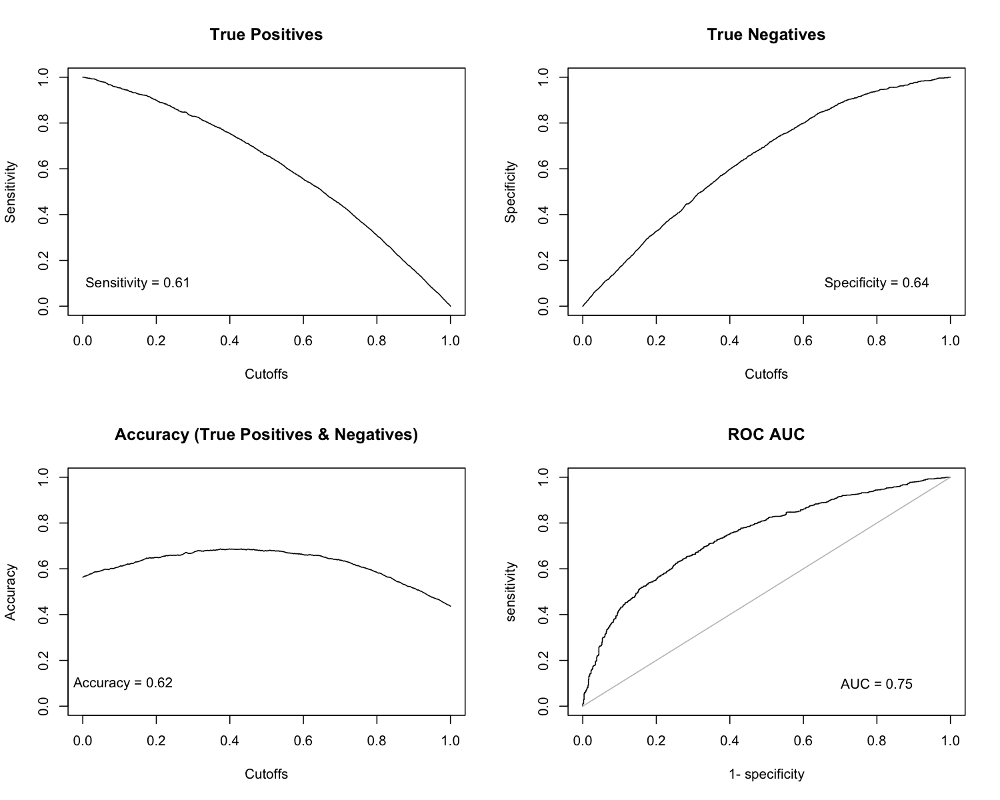

```{r setup, echo=FALSE, warning=FALSE, message=FALSE}
library(pander)
library(ggplot2)
library(dplyr)
library(lme4)
library(readr)
library(RPostgreSQL)
library(boot)

source("~/.Rprofile")
#library(RPostgreSQL)
#library(lubridate)
#library(conteStreamTemperature)
#library(texreg)
# library(stargazer)
#library(tables)

# local_dir <- "Output" 
# data_dir <- local_dir # paste0(getwd(), local_dir)

#df <- readRDS(file.path(data_dir, "obs_predicted.RData"))
#df_fit <- readRDS("Data/fit.RData")
load("Data/fit_data_out.RData")
conte_preds <- read_csv(file = "Output/sheds_trout_predictions.csv")
df_valid <- readRDS("Data/valid.RData")

df_pa <- read_csv("Data/regional_occupancy_data.csv")
df_covariates <- readRDS("Data/covariates.RData") %>%
  dplyr::select(featureid, forest, AreaSqKM)
df_locations <- read.csv("Data/locations_clean.csv", header = T, stringsAsFactors = F)
#foo <- read.csv("Data/locations_clean.csv", header = T, stringsAsFactors = F)
df_ids <- read.csv("Data/locations_featureids.csv", header = T, stringsAsFactors = F)

df_ids <- df_ids %>%
  dplyr::mutate(featureid = as.integer(gsub(pattern = ",", "", FEATUREID)),
                id = as.integer(gsub(",", "", id)))

df_locations <- df_locations %>%
  dplyr::select(-latitude, -longitude)
  
# organize presence-absence data
df_pa <- df_pa %>%
  dplyr::left_join(df_ids) %>%
  dplyr::left_join(df_locations) %>%
  dplyr::select(-AreaSqKM) %>%
  dplyr::left_join(df_covariates) %>%
  dplyr::mutate(Occupancy = ifelse(catch > 0, 1, catch)) %>%
  dplyr::filter(!is.na(Occupancy),
                !is.na(AreaSqKM)) %>%
  #dplyr::distinct() %>%
  dplyr::rename(data_source = source)

# Get data relating featureid to states
db <- src_postgres(dbname='sheds_new', host='osensei.cns.umass.edu', port='5432', user=options('SHEDS_USERNAME'), password=options('SHEDS_PASSWORD'))

tbl_states <- tbl(db, 'catchment_state')

df_states <- dplyr::collect(tbl_states) %>%
  dplyr::rename(state = stusps)

# combine data and summarize
df_summary <- df_pa %>%
  dplyr::left_join(df_states) %>%
  dplyr::group_by(state) %>% #, data_source) %>%
  dplyr::summarise(samples = n(),
                   n_catchments = length(unique(featureid)),
                   #n_occ = sum(Occupancy),
                   min_yr = min(year_min),
                   max_yr = max(year_max)) %>%
  dplyr::mutate(min_yr = ifelse(is.na(min_yr), as.integer(1991), min_yr),
                max_yr = ifelse(is.na(max_yr), as.integer(2010), max_yr),
                range_yrs = max_yr - min_yr + 1)

```

## Abstract

Coming Soon

## Objectives

1. Evaluate landscape, land-use, and climate factors affecting the probability of Brook Trout occupancy in the eastern United States
2. Predict Brook Trout occupancy in each stream reach (confluence to confluence) across the region currently
3. Forecast Brook Trout occupancy under future conditions
4. Examine the tolerance  of Brook Trout to warming and forest change across space
5. Visualize climate mitigation potential through forest change

## Approach 

We used a logistic mixed effects model to include the effects of landscape, land-use, and climate variables on the probability of Brook Trout occupancy in stream reaches (confluence to confluence). We included random effects of HUC10 (watershed) to allow for the chance that the probability of occupancy and the effect of covariates were likely to be similar within a watershed. Our fish data came primarily from state and federal agencies (see below). We considered a stream occupied if any Brook Trout were ever caught during an electrofishing survey between 1991 and 2010.


## Observed Presence-Absence Data (Dependent Data)

```{r temperature data summary, echo=FALSE, results='asis', message='FALSE', warning='FALSE'}
# str(tempDataSync)
# str(tempDataSyncValid)
#str(df_states)

#dbDisconnect(db$con)

pandoc.table(df_summary,
             style = "rmarkdown",
             split.tables = Inf)

```

## Predictor Variables

Documentation related to the landscape, land-use, streams, catchment delineation, and climate variable data sources and processing can be found at [http://conte-ecology.github.io/shedsGisData/](http://conte-ecology.github.io/shedsGisData/).

| Variable | Description | Source | Processing | GitHub Repository |
|:--------:| --------------------------- | --------------- | ------------------------- | ----------------- |
| Total Drainage Area | The total contributing drainage area from the entire upstream network | [The SHEDS Data project](http://conte-ecology.github.io/shedsGisData/) | The individual polygon areas are summed for all of the catchments in the contributing network| [NHDHRDV2](https://github.com/Conte-Ecology/shedsGisData/tree/master/NHDHRDV2) |
| Riparian Forest Cover | The percentage of the upstream 200ft riparian buffer area that is covered by trees taller than 5 meters | [The National LandCover Database (NLCD)](http://www.mrlc.gov/nlcd06_data.php) | All of the NLCD forest type classifications are combined and attributed to each riparian buffer polygon  using GIS tools. All upstream polygon values are then aggregated.| [nlcdLandCover](https://github.com/Conte-Ecology/shedsGisData/tree/master/basinCharacteristics/rasterPrep/nlcdLandCover) |
| Daily Precipition | The daily precipitation record for the individual local catchment | [Daymet Daily Surface Weather and Climatological Summaries](https://daymet.ornl.gov/) | Daily precipitation records are spatially assigned to each catchment based on overlapping grid cells using the [zonalDaymet](https://github.com/Conte-Ecology/zonalDaymet) R package| [daymet](https://github.com/Conte-Ecology/shedsGisData/tree/master/daymet) |
| Upstream Impounded Area| The total area in the contributing drainage basin that is covered by wetlands, lakes, or ponds that intersect the stream network | [U.S. Fish & Wildlife Service (FWS) National Wetlands Inventory](http://www.fws.gov/wetlands/Data/Data-Download.html)| All freshwater surface water bodies are attributed to each catchment using GIS tools. All upstream polygon values are then aggregated.| [fwsWetlands](https://github.com/Conte-Ecology/shedsGisData/tree/master/basinCharacteristics/rasterPrep/fwsWetlands) |
| Percent Agriculture | The percentage of the contributing drainage area that is covered by agricultural land (e.g. cultivated crops, orchards, and pasture) including fallow land. | [The National LandCover Database](http://www.mrlc.gov/nlcd06_data.php)| All of the NLCD agricutlural classifications are combined and attributed to each catchment polygon using GIS tools. All upstream polygon values are then aggregated.| [nlcdLandCover](https://github.com/Conte-Ecology/shedsGisData/tree/master/basinCharacteristics/rasterPrep/nlcdLandCover) |
| Percent High Intensity Developed | The percentage of the contributing drainage area covered by places where people work or live in high numbers (typically defined as areas  covered by more than 80% impervious surface) | [The National LandCover Database](http://www.mrlc.gov/nlcd06_data.php)| The NLCD high intensity developed classification is attributed to each catchment polygon using GIS tools. All upstream polygon values are then aggregated. | [nlcdLandCover](https://github.com/Conte-Ecology/shedsGisData/tree/master/basinCharacteristics/rasterPrep/nlcdLandCover) |


## General Results

### Table of Model Results

**Fixed Effects:**

```{r coefficient table, echo=FALSE, warning=FALSE, message=FALSE, results='asis'}

library(data.table) # to convert rownames and column names into a table without wierd format problems

mod_sum <- summary(glmm.M32)

summary_fixed <- data.table(mod_sum$coefficients, keep.rownames = TRUE)
setnames(summary_fixed, c("rn", "Pr(>|z|)"), c("Parameter", "P-value"))

pandoc.table(summary_fixed,
             digits = 3,
             style = "rmarkdown",
             split.tables = 300)

df_fixed <- as.data.frame(summary_fixed)
```

**Random Effects (HUC10):**

```{r random effects table, echo=FALSE, warning=FALSE, message=FALSE, results='asis'}

results_rand <- ranef(glmm.M32)$fhuc10
results_rand <- data.table(t(dplyr::summarise_each(results_rand, funs(sd))), keep.rownames = TRUE)
results_rand$var <- results_rand$V1^2
setnames(results_rand, c("rn", "V1", "var"), c("Parameter", "SD", "Variance"))

pandoc.table(results_rand,
             digits = 3,
             style = "rmarkdown",
             split.tables = 300)

# library(stargazer)
# stargazer(glmm.M32, 
#           type = "html", 
#           single.row = TRUE,
#           dep.var.labels   = "Prob. Occ (SE)",
#           intercept.bottom = FALSE, 
#           align = TRUE)

```

These results indicate that mean July stream temperature had the largest (negative) effect on the probability of Brook Trout occupancy. Forest cover within the 200 foot riparian buffer had a strong positive effect on occupancy, whereas agriculture within the entire upstream drainage had a negative effect on occupancy. Mean summer precipitation has a positive effect on occupancy and the effect was larger with increasing levels of riparian forest cover, but was not dependent on stream drainage area. The total impounded area on the stream network (allonnet) had a negative effect on Brook Trout occupancy as did the upstream drainage area. Surficial coarseness was positively correlated with the presence of Brook Trout, which may be a result of better physical habitat structure or as an indication of local groundwater upwelling.


The average occupancy across the range of observed catchments was `r round(plogis(df_fixed[which(df_fixed$Parameter == "(Intercept)"), "Estimate"]), 2)`.

The effects of these landscape and climate characteristics are similar to what has been observed in other Brook Trout studies. (**More detailed comparison with Downstream Strategies and DeWeber and Wager (2014) coming soon**)

### Model Fit

We examined the false positive and false negative rates and used the Area Under the Receiver Operating Characteristic ROC) curve (AUC) to assess the model fit.

<u>Definitions</u>

* AUC - measures a model's ability to determine which locations are occupied (Zipkin et al. (2012) *Ecological Applications*)
* Sensitivity - true positive rate (="recall rate")
* Specificity - true negative rate
* 1-Specificity - false positive rate (Type I Error rate; ="fall-out rate")
* 1-Sensitivity - false negative rate (Type II Error rate; ="miss rate")
* Accuracy - ability to identify true positives and true negatives
* ROC - The curve is created by plotting the true positive rate (sensitivity) against the false positive rate (1-specificity) at various threshold settings

The model output (predictions) are the probability of occupancy but the data are observed presence and absence (1 or 0). Therefore, it is difficult to evaluate how well the model predicts the data. The probabilities of occupancy must be coverted to presence-absences for comparison. We do this over a range of thresholds (= cutoffs). The threshold is the probability above which the stream is assumed to be occupied (Brook Trout = present). For example, if the probability of occupancy for a stream is 0.45 and we set a threshold = 0.50, we would assign the stream as unoccupied (absent). However, if we used a threshold of 0.4 then this same stream would be assigned as occupied (present). If the true (observed) state of the stream was occupied, then using a threshold of 0.5 would result in a false absence (predicted absent when really present) but if we used a threshold of 0.4 we would correct assign the stream as occupied (true positive). Assigning a threshold is a balance of trade-offs between false positives and false negatives. The balance is based on the risk tolerance to the consequences of type I and type II errors.

AUC can range from 0-1. An AUC value of 0.5 indicates the model does no better than random chance in discriminating occupancy. Models with AUC >0.7 are considered to have good discrimination in assessing the probability of occupancy.


Our model is a good fit to the data and has a very strong ability to assess the probability of occupancy.

### Model Validation

More important than how well the model works with the data used to fit the model is the ability of the model to predict occupancy at unsurveyed locations. To assess this predictive power, we used data from the `r length(unique(df_valid$featureid))` stream reaches withheld from model fitting. We use the term "fitted data" to refer to the data we used to fit (estimate) the model. For comparison, others use the terms "training data" or "calibration data" synonymously. Validation data are the independent data withheld from model fitting for the purpose of understanding how well a model predicts to unobserved space and time. To evaluate this predictive power, we plotted the false positive rate (1-specificity) vs. the true positive rate (sensitivity) and calculated the AUC.



The AUC when predicting for the validation data was 0.75, which indicates that the model has good ability to discriminated between occupied and unoccupied stream reaches (catchments) for locations without survey data. From this we are highly confident in the model's ability to predict occupancy across the region.


## Comparison with Other Models

DeWeber and Wagner (2014) used a similar model to predict Brook Trout occupancy throughout the native eastern range. Downstream Stategies (DSS) also modeled the probability of Brook Trout occupancy for the Chesapeake Bay watershed. DSS used a different approach, employing boosted regression trees to fit the presence-absence data. This is a machine learning method that allows for non-parametric correlations between dependent (predictor) and independent (response) variables. We present a comparison of the error rates reported for each group over a range of occupancy thresholds.

```{r error rate comparisons, echo=FALSE, warning=FALSE, message=FALSE, results='asis'}
valid.rates <- readRDS(file = "Output/validation_error_table.rds")

pandoc.table(valid.rates,
             digits = 3,
            keep.trailing.zeros = TRUE,
             style = "rmarkdown",
             split.tables = 300)

compare.rates <- valid.rates %>%
  dplyr::ungroup() %>%
  dplyr::select(Threshold = thresholds, Conte_FNR = FNR, Conte_FPR = FPR) %>%
  dplyr::mutate(DSS_FNR = c(NA_real_, 0.09, NA, NA, NA, NA),
                DSS_FPR = c(NA_real_, 0.10, NA, NA, NA, NA),
                DeWeber_FNR = c(NA_real_, NA, 0.34, NA, NA, NA),
                DeWeber_FPR = c(NA_real_, NA, 0.22, NA, NA, NA))

pandoc.table(compare.rates,
             digits = 3,
            keep.trailing.zeros = TRUE,
             style = "rmarkdown",
             split.tables = 300)
```

The least biased comparison is when holding one of the error rates constant (e.g. 10%) and calculating the other error rate. The threshold for this will differ for each data set and model but is roughly comparable.

```{r constant error rate comparison, echo=FALSE, warning=FALSE, message=FALSE, results='asis'}
valid.rates <- readRDS(file = "Output/validation_error_table.rds")

compare.rates <- valid.rates %>%
  dplyr::ungroup() %>%
  dplyr::select(Threshold = thresholds, Conte_FNR = FNR, Conte_FPR = FPR) %>%
  dplyr::mutate(DSS_FNR = c(NA_real_, 0.09, NA, NA, NA, NA),
                DSS_FPR = c(NA_real_, 0.10, NA, NA, NA, NA),
                DeWeber_FNR = c(NA_real_, NA, 0.34, NA, NA, NA),
                DeWeber_FPR = c(NA_real_, NA, 0.22, NA, NA, NA))

rates.10 <- data.frame(Group = c("Conte", "DeWeber", "DSS", "Conte", "DeWeber", "DSS"),
           FNR = c(0.10, 0.10, 0.10, 0.57, 0.58, 0.09),
           FPR = c(0.67, 0.50, 0.09, 0.10, 0.10, 0.10))

pandoc.table(rates.10,
             digits = 3,
            keep.trailing.zeros = TRUE,
             style = "rmarkdown",
             split.tables = 300)

```

Although we compared errors rates over a range of thresholds, there are still differences in the interpretation of error rates among studies. We used similar methods and data as DeWeber and Wagner (2014) and the error rates should be closely comparable, especially the comparison of error rates when using the observed prevalence to establish the thresholds (cutoffs). DSS used very different data sources and different methods making even their predictive performance less comparable. For example, they included rivers up to 17,000 $km^2$, whereas we limited our analysis to streams < 200 $km^2$ and only used streams where surveys were done targeting trout using electrofishing methods. Larger rivers in this region have virtually zero probability of wild Brook Trout occupancy. Therefore, including these rivers, which are nearly all 0, makes for easier prediction and inflates the model performance in relation to more restrictive models such as ours. Neither method is right or wrong, but rather provide slightly different inference. Our model focuses on distinguishing the probability of occurrence for headwater streams potentially suitable for wild trout populations throughout the northeast U.S. The DSS analysis provides a broader overview of streams and rivers likely to support Brook Trout across all flowing waters in the Chesapeake Bay Watershed. Even accounting for those differences, the high accuracy and balance of false positives and negatives suggests that the DSS model likely produces more consistently accurate predictions of Brook Trout occurrence within the Chesapeake Bay Watershed compared with either of the larger regional models.

### Direct Comparison

Our predictions were on slightly different flowlines and catchment delineations than those used by Downstream Strategies. To make explicit comparison of predictions from the two models, we rasterized the DSS predictions and performed zonal statistics to calculate the area-weighted average in each of our catchments (associated with each stream reach). 


```{r dss comparison, echo=FALSE, warning=FALSE, message=FALSE, results='asis'}
# import downstream strategies predictions
dss_preds <- read_csv("Data/hrd_final_preds.csv")
dss_preds <- dss_preds %>%
  dplyr::mutate(featureid = as.integer(gsub(",", "", FEATUREID))) %>%
  dplyr::rename(dss_pred = final_preds)

# combine fitted and validation data and do predictions
# conte_preds <- dplyr::bind_rows(df.fit, df.valid) %>%
#   dplyr::mutate(featureid = as.integer(featureid))
# conte_preds$conte_pred <- inv.logit(predict(glmm.M32, conte_preds, allow.new.levels = TRUE))

# join with our predictions
df_preds <- dplyr::left_join(dss_preds, conte_preds) %>%
  dplyr::rename(conte_pred = current)

g <- ggplot(df_preds, aes(conte_pred, dss_pred)) + geom_point(alpha = 0.2, colour = "gray10", size = 0.7) + geom_abline(intercept = 0, slope = 1, colour = "red") + theme_bw() + xlab("Predictions") + ylab("DSS Predictions")
g + geom_density2d(size = 0.4)

#g + stat_density2d(aes(fill = ..level..), geom = "polygon")

#g + stat_density2d(geom = "tile", aes(fill = ..density..), contour = FALSE)

#g + stat_binhex()

#cor(df_preds$dss_pred, df_preds$conte_pred, use = "pairwise.complete.obs")


```


**more comparisons and results coming soon**


